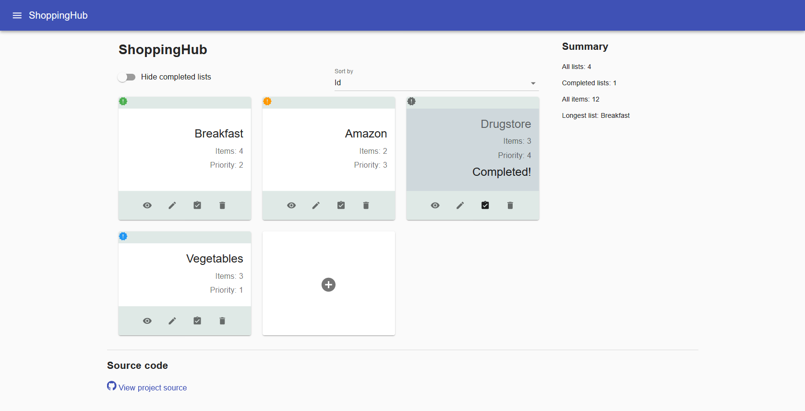

# ShoppingHub
This application helps you to organize your shopping lists. You can add, delete, view and edit contents of each shopping list. 

## How to run this app ?
Clone this repository to your hard drive with:
#### `git clone https://github.com/kjuraszek/shopping-hub`

Install dependencies in project directory:
#### `npm install`

Start app in development mode:
#### `npm start`
Open [http://localhost:3000](http://localhost:3000) to view it in the browser.

Running:
#### `npm run build`
builds the app for production to the `build` folder.

## How to use this app ?
- add a new list with a Add New List button
- manage each list using its control buttons: view / edit / mark as completed / delete